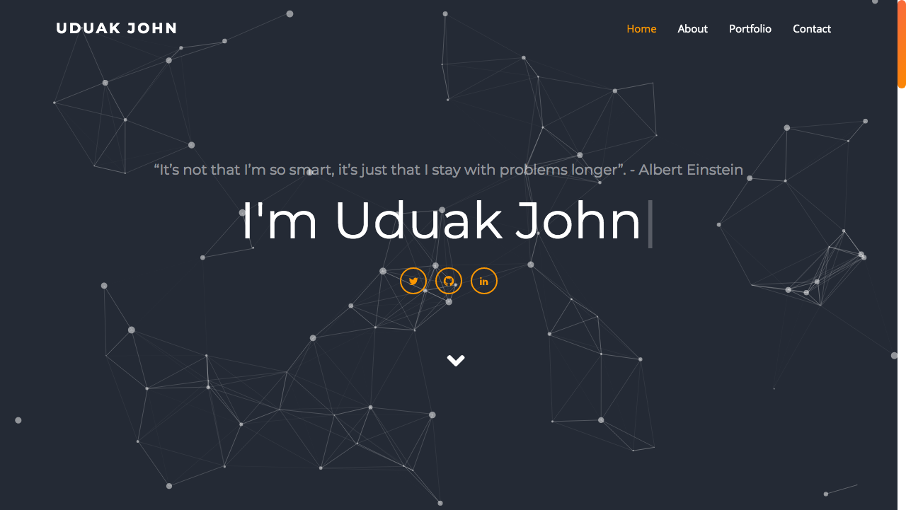

## Uduak John

### [uduak.me](https://uduak.me)

### About Me

I am a Software Developer focused on building high-quality, thoughtful, and intuitive websites and web applications. I’m currently enrolled in a Full-stack web development program remotely and studying through pair-programming with amazing folks all around the world at [Microverse](https://www.microverse.org/)

As a software development student at [Microverse](https://www.microverse.org/), I've had the opportunity to work along-side professionals in notable projects. I value the ideas of hard-work and persistence. These values have aided my career as a developer and have shaped me into the person I am today.

I like to spend my free time adding on to my web stack and chasing my dream of becoming a full-time software engineer. Other than coding, I find myself voraciously reading books on entrepreneurship, psychology and history, learning new languages, writing about mental health, and basically just taking photos of everything that comes close to sunsets and natural beauties in their original elements.

### Social Media

[Github](https://github.com/udberg)
[Twitter](https://twitter.com/juduak_)
[Linkedin](https://www.linkedin.com/in/juduak/)
